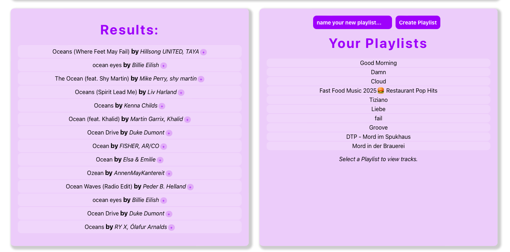

# Music App

This is a React Music App created with the Spotify API.

## Features

- Spotify Login (OAuth 2.0)
- See the song that is now playing on Spotify
- Search for songs, get a list and the option to add them to a selected plalist and get a preview or the link to the full song on Spotify
- List of playlists and option to create a new one
- See the songs of a selected playlist, option to change the name or remove songs
- See the recently played songs
- See your top 5 artists
- Secure Logout

### Technologies

- React (Frontend)
- Spotify Web API
- Spotify-Authentication-Server (hostet on Render.com)
- Netlify (Hosting der React App)

### Installation

Follow these steps to set up and run the Music App locally:

1. Clone the repository:

```bash
git clone https://github.com/sabrinaaileen/music-app
```

2. Navigate into the project directory:

```bash
cd music-app
```

3. Install all dependencies:

```bash
npm install
```

4. (Optional) Create a .env file in the root directory:

```env
REDIRECT_URI=https://spotify-authentication-server.onrender.com
```

5. Start the development server:

```bash
npm start
```

6. Open your browser and navigate to:

```bash
http://localhost:3000
```

### Troubleshooting

If you encounter any issues while running the Music App, check the following:

#### 1. Spotify login fails or shows an error

- Ensure your Auth Server is correctly deployed (e.g. on Render)
- Confirm the Redirect URI matches exactly in your Spotify Developer Dashboard

#### 2. "No token provided" or "401 Unauthorized" errors

- Make sure the token is correctly stored in localStorage
- Verify that API requests include the `Authorization: Bearer <token>` header
- Try logging out and logging back in to refresh the token

#### 3. Plalist list is empty after login

- Ensure the token is set using `spotifyApi.setAccessToken(token)` before making requests
- Manually refresh the playlist if necessary

#### 4. Development server doesn't start

- Confirm Node.js and npm are installed correctly
- Run `npm install` to ensure all dependencies are installed
- Ensure you are running the app inside the correct project folder

#### 5. Environment variables not recognized

- Check that the `.env` file is located at the project root
- Environment variables must start with `REACT_APP_` to be recognized by Create React App
- Restart your server after changing the `.env` file

### License

This project is licensed under the [MIT License](https://opensource.org/licenses/MIT).

### Author

- Sabrina Aileen Hodapp
- sabrinaaileen (https://github.com/sabrinaaileen)
- https://www.sabrina-aileen-hodapp.de

### Photos





## Learn More

You can learn more in the [Create React App documentation](https://facebook.github.io/create-react-app/docs/getting-started).

To learn React, check out the [React documentation](https://reactjs.org/).

To learn more about the [Spotify Web API](https://developer.spotify.com/documentation/web-api).
